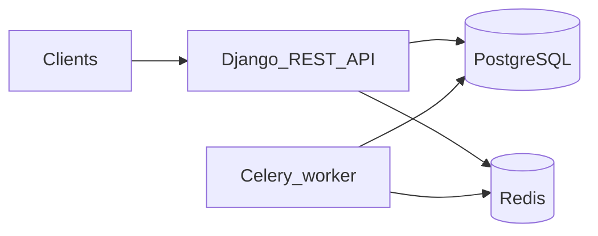

# beaconflame-api

API-only decisioning backend: intake applications, run an asynchronous pipeline (enrichment, features, weighted scoring, deterministic policy rules), persist decisions with audit trails, and support manual overrides and dual authentication (JWT for staff, API keys for external clients).

## Architecture



- **Transport**: Versioned REST under `/api/v1/` (DRF). Views stay thin; **services** own domain logic (`apps/applications/services.py`, `apps/scoring/engine.py`, `apps/policies/engine.py`, `apps/decisions/services.py`, `apps/audits/services.py`).
- **Auth**: `BearerOrApiKeyAuthentication` supports `Authorization: Bearer` (SimpleJWT) and `Api-Key` / `X-Api-Key`. API keys are stored **hashed** with `API_KEY_PEPPER`. Roles: `admin`, `analyst`, `api_client` (see `apps/authentication/permissions.py`).
- **Audit**: `AuditService.record` is the single write path for `AuditLog` rows; pipeline stages and admin actions call it with correlation IDs from `X-Request-Id` middleware.
- **Async**: `POST /api/v1/applications` enqueues a Celery **chain** (`enrich_application` → `compute_features` → `run_scoring` → `evaluate_rules` → `persist_decision` → `dispatch_webhook_placeholder`). Retries apply to transient DB/connection errors; failures set status `failed` and emit `pipeline.failed` audits.

## Local development

### Docker Compose (PostgreSQL + Redis + web + worker)

```bash
docker compose up --build
```

API: `http://localhost:8000/api/v1/`. Migrations run on container start via `docker/entrypoint.sh`.

Seed default policy rules:

```bash
docker compose exec web python manage.py seed_policy_rules
```

### Without Docker (SQLite by default)

```bash
python3 -m venv .venv && source .venv/bin/activate
pip install -r requirements-dev.txt
export DJANGO_SETTINGS_MODULE=config.settings.local
set -a && source .env.demo && set +a
python manage.py migrate
python manage.py seed_policy_rules
python manage.py createsuperuser
celery -A config worker -l info   # separate terminal; needs Redis if not using eager
python manage.py runserver
```

Copy [`.env.example`](.env.example) to `.env` and adjust `DATABASE_URL`, `REDIS_URL`, `CELERY_*`, `SECRET_KEY`, and `API_KEY_PEPPER` for non-Docker Postgres/Redis.

### Tests

```bash
pytest
```

## API examples

Login (JWT):

```bash
curl -s -X POST http://localhost:8000/api/v1/auth/login \
  -H "Content-Type: application/json" \
  -d '{"email":"you@example.com","password":"your-password"}'
```

Submit an application (use `Authorization: Bearer <access>` or `Api-Key bf_live_...`):

```bash
curl -s -X POST http://localhost:8000/api/v1/applications/ \
  -H "Authorization: Bearer <access>" \
  -H "Content-Type: application/json" \
  -H "Idempotency-Key: optional-unique-key" \
  -d '{"payload":{"amount":12000,"velocity_score":0.2,"history_score":0.6,"geo_risk":0.1}}'
```

## Rate limiting

DRF `DEFAULT_THROTTLE_RATES` defines `auth_login`; add `throttle_classes` on sensitive viewsets and enable `DEFAULT_THROTTLE_CLASSES` with a Redis-backed cache for production-scale throttling.

## Modular scoring and rules

- **Scoring**: `WeightedScoringEngine` in [`apps/scoring/engine.py`](apps/scoring/engine.py) — swap implementation or weights without changing views.
- **Rules**: `RuleEngine` in [`apps/policies/engine.py`](apps/policies/engine.py) evaluates active `PolicyRule` rows in **deterministic order** (`priority`, then `id`); **first match wins**. Conditions support `min_score`, `max_score`, `risk_band`, and optional `feature_path` / `feature_equals` / `feature_min` against the feature snapshot.
